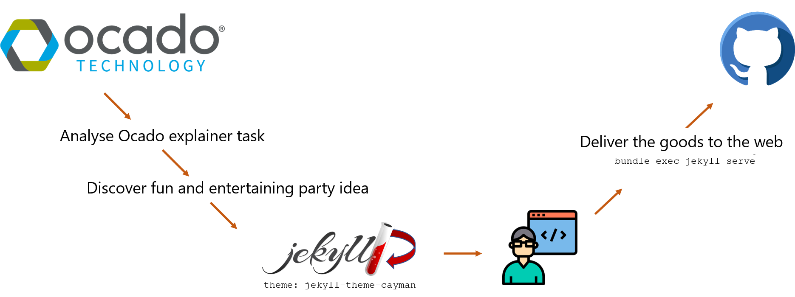

[Home](index.html)

# Going Meta

On this page, I discuss a few thoughts about the writing task as well as some of my decisions on the Jekyll theme and approach.

* [Markdown and Jekyll](#markdown-and-jekyll)
* [My Take](#my-take)
* [Adios](#adios-amigos)


## Markdown and Jekyll

So yes, I don't use `markdown` as much as I use `asciidoc`, but overall, it seems easy enough to use efficiently and integrates well with the docs-as-code approach. In the case of this assignment, I followed the flow as below:



## My Take

I like to contextualise things. Because of this, I chose our current situation (good ol' self-isolation in the time of *COVID-19*) and pitched the concept of a physical party to someone who might have forgotten what they entail. I hope it was clear, but also enjoyable to read.

## Adios Amigos

```javascript
alex.tried('task')
    return {
        offer: "cool-job"
    };
```
